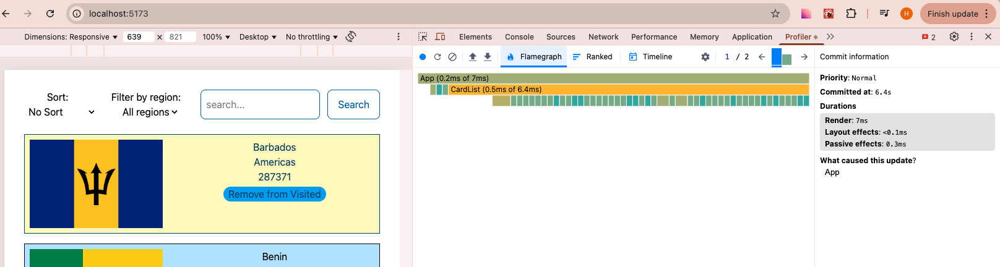
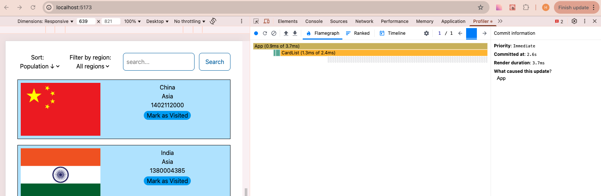
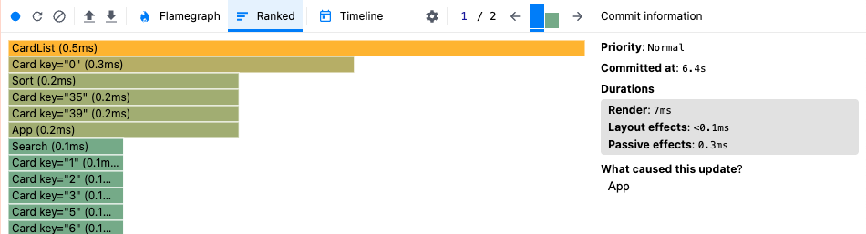
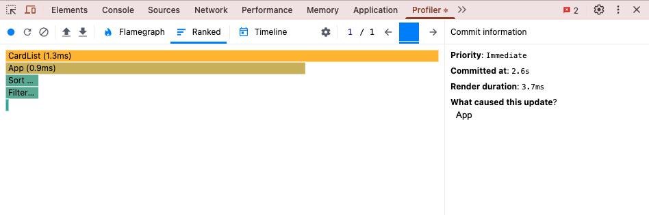
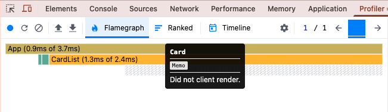

### **App Performance**

This section provides a comparison of the application's performance **before** and **after** applying several optimizations. We analyze key metrics, including commit duration, render duration, and interaction performance, along with insights from the Flame Graph and Ranked Chart.

#### **Performance Metrics:**

1. **Commit Duration:**

   - **Before Optimization: 6.4s**
   - **After Optimization: 2.6s**

2. **Render Duration:**

   - **Before Optimization: 7ms**
   - **After Optimization: 3.7ms**

3. **User Interaction:**

   - **Interaction: Sorting countries**

4. **Flame Graph:**

   - **Flame Graph Before Optimization:**
     

   - **Flame Graph After Optimization:**
     

5. **Ranked Chart:**

   - **Ranked Chart Before Optimization:**
     

   - **Ranked Chart After Optimization:**
     

#### **Performance Analysis**

_Before Optimization:_
The application demonstrated a high commit duration (6.4 seconds) when sorting countries, which indicates a significant delay in processing user interactions. The render duration, while relatively small at 7ms, was part of a larger overall delay during the sorting interaction.

Both the Flame Graph and Ranked Chart highlighted components that were contributing to inefficient rendering, which suggested room for improvement.

_Steps for Optimization:_

1. **Use useMemo for Memoization:**
  Applied useMemo to optimize the computation of the filtered, searched, and sorted list of countries. This ensures that the list is only recalculated when relevant dependencies (regionFilter, searchQuery, and sortBy) change, preventing unnecessary recalculations on every render.
  Memoized the initial state of visitedCountries to retrieve and parse the data from localStorage only once when the component mounts, reducing redundant parsing operations on re-renders.
2. **Use useCallback to Memoize Event Handlers:**
  Used useCallback to memoize event handler functions for filtering, searching, and sorting. This prevents unnecessary function re-creations on every render, improving performance when passing these handlers as props to child components.
3. **Use React.memo for Card Component:**
  Wrapped the Card component in React.memo to prevent unnecessary re-renders of individual country cards when the parent (CardList) re-renders, unless the props passed to the Card change.
4. **Correct Usage of the key Prop:**
  Replaced the index (key={ind}) with a unique property (key={country.name.common}) for each country card, ensuring proper reconciliation by React and preventing unnecessary renders when the list is updated.

_Performance Improvements:_
After applying the optimizations, the application demonstrated significant performance gains:

 - Commit Duration was reduced from 6.4s to 2.6s (≈59% improvement), leading to faster UI updates.
 - Render Duration improved from 7ms to 3.7ms (≈47% improvement), reducing the time required to render components.
 - User Interactions (e.g., sorting countries) became smoother and more responsive, eliminating noticeable UI lag.
 - Flame Graph & Ranked Chart confirm reduced component re-renders, indicating that individual country cards no longer re-render unnecessarily during sorting, thanks to memoization techniques.
 

These optimizations have significantly improved application efficiency, ensuring faster, more scalable, and seamless user experiences.

